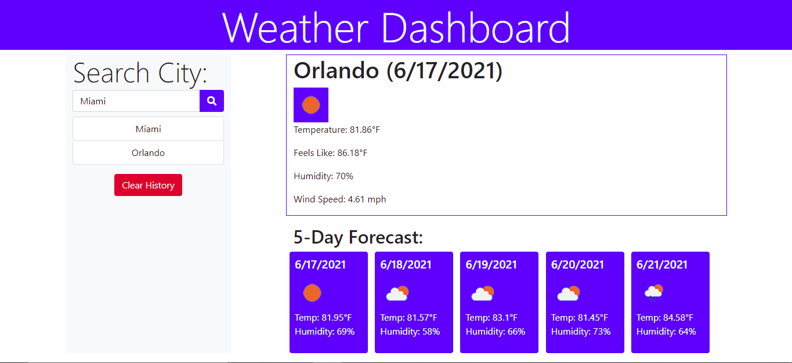

# Weather Dashboard

## Table of Contents
- [Description](#description)
- [Features](#features)
- [Technology Used](#technology-used)
- [Authors](#authors)

## Description
This web application will allow the user to search for weather of any city they may desire. The information that is displayed comes from the Open Weather Map API and provides the current day forecast along with the 5-Day forecast.

## Features
- The user may search for any city that they would like to know the forecast of.

- Displays the current day forecast along with the 5-Day forecast.

- Search for another city and a history lsit is displayed under the search bar.

- Click on a previously search city and it will display the information again.

## Technology Used
- HTML
- CSS
- Bootstrap
- Font Awesome
- JavaScript
- jQuery
- Open Weather Map API

## Authors
- Jack Ceballos